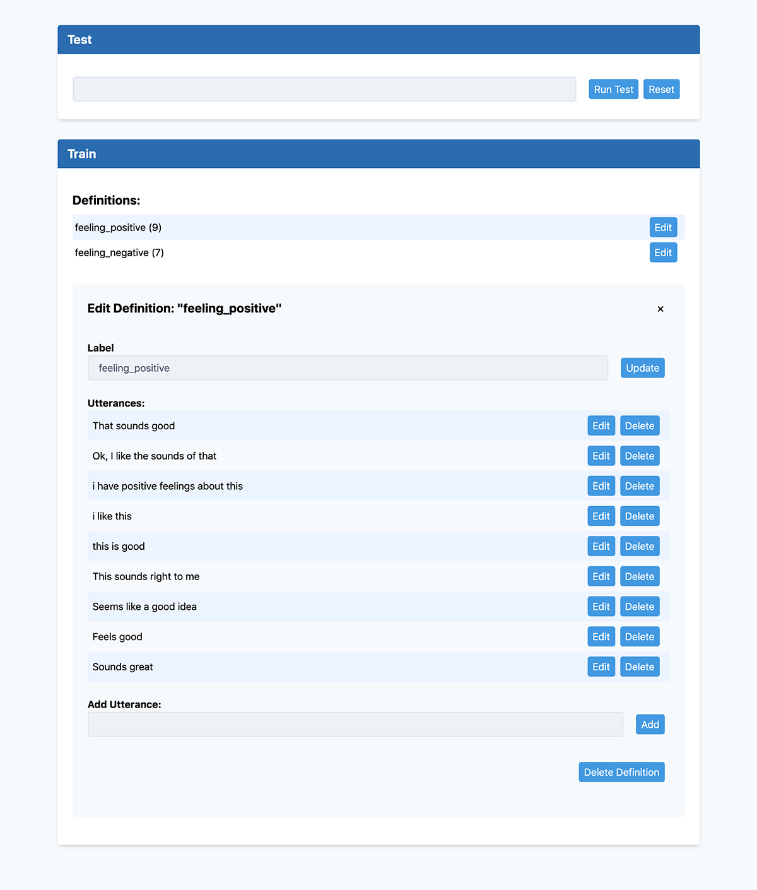
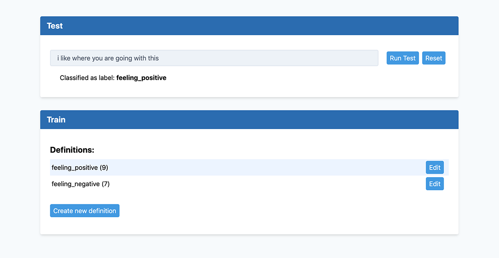

# SimpleClassifier

Manage text intent classifications and natural language training utterances.

## Overview

Client/server app to manage training data using the [Wink Naive Bayes Classifier](https://winkjs.org/wink-naive-bayes-text-classifier/). Server hosted on AWS, managed by AWS CDK, built with Node.js. Client built with TypeScript, React and Tailwind.css.

_Add training definitions and example utterances_

_Test classification with utterance_

## Server

Requires an AWS account with [AWS CDK](https://docs.aws.amazon.com/cdk/latest/guide/getting_started.html) installed.

If you use an [AWS Profile](https://docs.aws.amazon.com/cli/latest/userguide/cli-chap-configure.html), update [package.json](server/package.json#L8) with your profile id.

If using a profile, you may need to bootstrap CDK:

    cdk bootstrap "aws://[profile_account_id]/[profile_default_region]" --profile [profile_id]

Install dependencies in both the server root _and_ inside [server/src](server/src):

    npm install

The second dependencies inside server/src is required for the lambda functions CDK code bundling limitations at the time this project was created.

Create and deploy the stack:

    npm run deploy

Creates: an API Gateway, a pay per request DynamoDB instance, and 5 Lambda instances.

## Client

Create an `.env` file with the generated server endpoint url:

    REACT_APP_SERVICE_URL=https://[instance].execute-api.[region].amazonaws.com

Install dependencies:

    npm install

Run client app on localhost:

    npm start

Run tests:

    npm run test

Please define at least two definitions and a handful of utterances for each before testing classifier.

## TODO

- API authentication

## License

[MIT](https://opensource.org/licenses/MIT)
